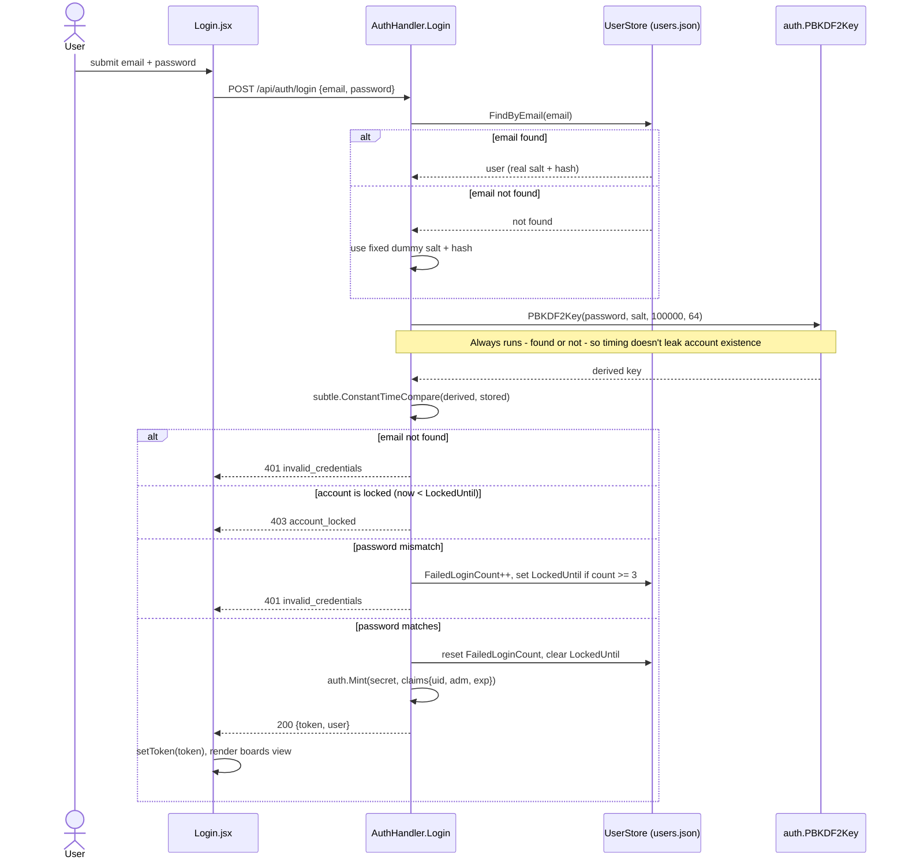

# Sequence Diagram — Login

`login` (`api/app/routers/auth.py`) is written so PBKDF2 always runs — for a real user or a fixed dummy salt/hash — before any branch that could return early, so response timing can't reveal whether an email is registered. See [`../decisions/0002-pbkdf2-via-hashlib.md`](../decisions/0002-pbkdf2-via-hashlib.md) and [`../features/authentication.md`](../features/authentication.md).

Notable: the "email not found" and "password mismatch" branches both return the same generic `401 invalid_credentials` (never a distinct "no such account" message), and both are reached only *after* the PBKDF2 call above — the dummy-hash branch exists specifically so that cost is paid identically in both cases.
