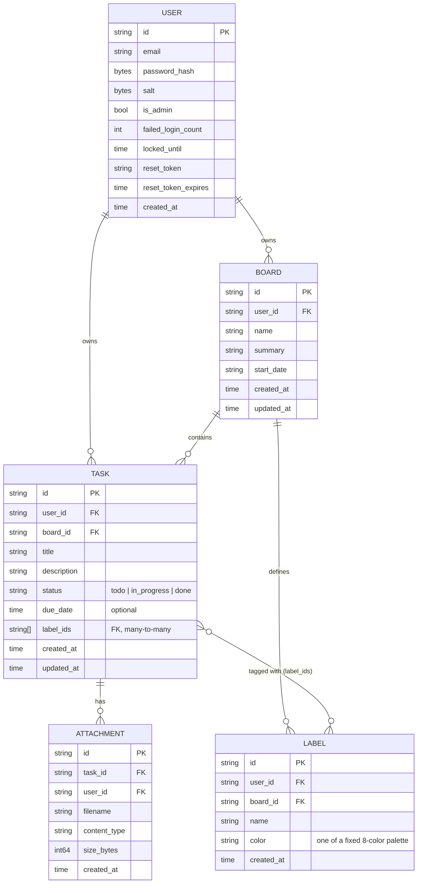

# Data Model

Five entity collections, each persisted as its own JSON file under `data/` (see [`../decisions/0004-json-file-storage-atomic-writes.md`](../decisions/0004-json-file-storage-atomic-writes.md)). There's no foreign-key enforcement at the storage layer — ownership and referential checks (a board belongs to this user, a task's board exists and is owned by this user, etc.) happen in the handlers, not the database, since there is no database.

Key points:

- **IDs** are 32-character random hex strings (`api/app/idgen.py`), not incrementing integers — generated client-independently, no coordination needed.
- **`Attachment` rows are metadata only** (`data/attachments.json`); the binary content lives as a separate file at `data/attachments/<attachment-id>`, addressed by the same ID (see [`../features/attachments.md`](../features/attachments.md)).
- **Cascade on delete** is enforced in the handlers, not the storage layer: deleting a `BOARD` deletes its `TASK`s, their `ATTACHMENT`s, and its `LABEL`s; deleting a `TASK` deletes its `ATTACHMENT`s (see [`../decisions/0006-cascading-deletes.md`](../decisions/0006-cascading-deletes.md)). Deleting a `LABEL` is the first case where "cascade" means stripping a *reference* rather than deleting the referencing resource: every `TASK.label_ids` containing that label has the ID removed, but the task itself stays (see [`../features/labels.md`](../features/labels.md)).
- `User.password_hash` / `salt` / `reset_token*` are never serialized to API responses — handlers always return `User.public()` (see `api/app/models.py`).
