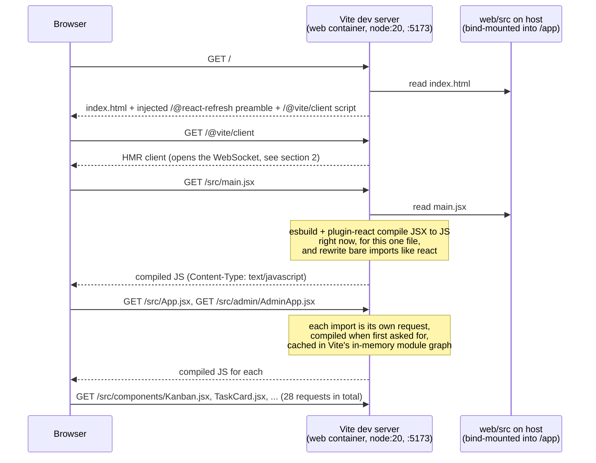
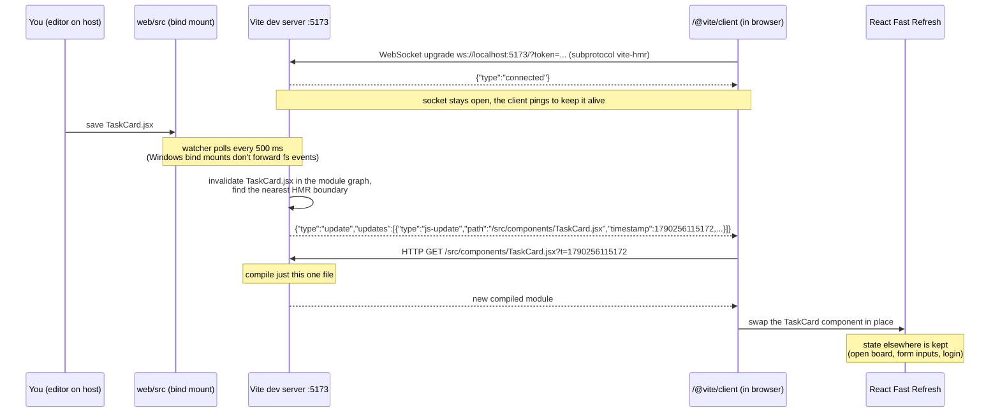
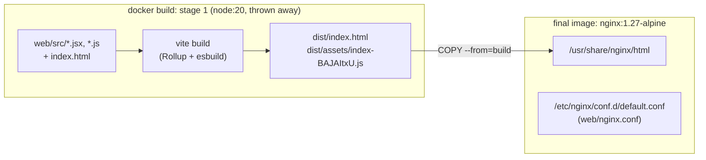
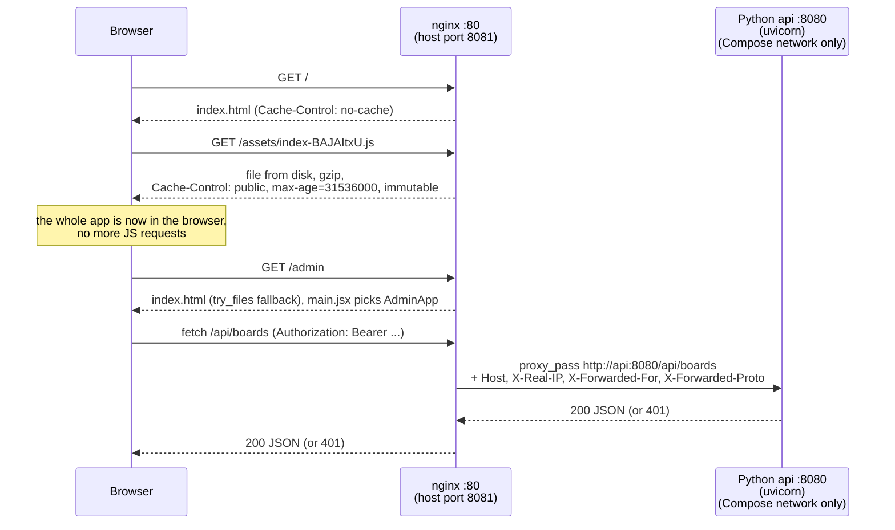

# Serving the Frontend: Dev Mode vs Production Mode

The React code in `web/src` is written as `.jsx`, which browsers can't run. Something has to compile it to plain JavaScript. The two modes differ in **when** that happens and **who** serves the result:

- **Dev mode** (`docker compose up`, port 5173): a Node process, the Vite dev server in the `web` container, compiles each file **on demand** when the browser asks for it. It keeps a **WebSocket** open to the browser so it can push "this file changed" notifications the moment you save.
- **Production mode** (`docker compose -f docker-compose.prod.yml up -d --build`, port 8081): everything is compiled and bundled **once, at image build time**. **nginx** serves the resulting static files and reverse-proxies `/api/*` to the Python API. No Node process runs at all.

All requests, responses and WebSocket messages quoted below were captured from this repo's running stacks, not paraphrased from Vite's docs. Versions: Vite 5.4, `@vitejs/plugin-react` 4, nginx 1.27.

## At a glance

| | Dev mode | Production mode |
|---|---|---|
| Compose file | `docker-compose.yml` | `docker-compose.prod.yml` |
| Browser talks to | Vite dev server (Node) on `:5173` | nginx on `:8081` |
| When JSX becomes JS | On every request, per file, in memory | Once, during `docker build` (`vite build`) |
| What the browser downloads | ~28 separate modules (`/src/App.jsx`, `/src/components/Kanban.jsx`, …) plus pre-bundled deps | `index.html` + **one** file, `/assets/index-<hash>.js` (177 kB, 55 kB gzipped) |
| Code is | Readable, with inline source maps and dev-only React checks | Minified, tree-shaken, production React |
| `/api/*` handled by | Vite's built-in proxy → `http://api:8080` | nginx `proxy_pass` → `http://api:8080` |
| Change propagation | Push over a WebSocket, hot module replacement within ~0.5 s | None; rebuild the image |
| Caching | `Cache-Control: no-cache` + ETags on every module | Hashed assets `immutable` for 1 year; `index.html` `no-cache` |
| Node.js at runtime | Yes (`node:20` container) | **No** (`nginx:alpine`; Node exists only in a discarded build stage) |
| Python API | `uvicorn --reload` restarts on `.py` changes | uvicorn, one worker, `python:3.12-slim` with only the venv + `app/`; not published on the host |

---

## Dev mode

### 1. On-demand compilation: no precompiled JS anywhere



**Step 1: `index.html` is rewritten on the fly.** The file on disk (`web/index.html`) only contains `<script type="module" src="/src/main.jsx">`. What Vite actually serves at `GET /`:

```html
<head>
  <script type="module">import { injectIntoGlobalHook } from "/@react-refresh";
injectIntoGlobalHook(window);
window.$RefreshReg$ = () => {};
window.$RefreshSig$ = () => (type) => type;</script>

  <script type="module" src="/@vite/client"></script>
  ...
<body style="margin: 0;">
  <div id="root"></div>
  <script type="module" src="/src/main.jsx"></script>
```

The two injected scripts are the React Fast Refresh runtime and the HMR client. Neither exists in production.

**Step 2: a `.jsx` URL returns JavaScript.** The browser asks for `/src/main.jsx` as a native ES module. Source on disk:

```jsx
import { createRoot } from 'react-dom/client'
import App from './App.jsx'
import AdminApp from './admin/AdminApp.jsx'

const root = createRoot(document.getElementById('root'))
root.render(window.location.pathname.startsWith('/admin') ? <AdminApp /> : <App />)
```

What `GET http://localhost:5173/src/main.jsx` returns (`Content-Type: text/javascript`, `Cache-Control: no-cache`), compiled at that moment:

```js
import __vite__cjsImport0_react_jsxDevRuntime from "/node_modules/.vite/deps/react_jsx-dev-runtime.js?v=e0acfac0"; const jsxDEV = __vite__cjsImport0_react_jsxDevRuntime["jsxDEV"];
import __vite__cjsImport1_reactDom_client from "/node_modules/.vite/deps/react-dom_client.js?v=d0d18d40"; const createRoot = __vite__cjsImport1_reactDom_client["createRoot"];
import App from "/src/App.jsx";
import AdminApp from "/src/admin/AdminApp.jsx";
const root = createRoot(document.getElementById("root"));
root.render(window.location.pathname.startsWith("/admin") ? /* @__PURE__ */ jsxDEV(AdminApp, {}, void 0, false, {
  fileName: "/app/src/main.jsx",
  lineNumber: 6,
  columnNumber: 61
}, this) : /* @__PURE__ */ jsxDEV(App, {}, void 0, false, { ... }, this));
//# sourceMappingURL=data:application/json;base64,...
```

What changed:
- `<AdminApp />` became `jsxDEV(AdminApp, …)`. That's the JSX transform, in its development flavour with file/line info for React's warnings.
- `'react-dom/client'` became `/node_modules/.vite/deps/react-dom_client.js?v=…`. Browsers can't resolve bare package names, so Vite rewrites them. Third-party packages (React, ReactDOM) are the one thing Vite *does* pre-bundle, once, with esbuild into `node_modules/.vite/deps`. They're CommonJS and have hundreds of internal files, so serving them unbundled would be slow.
- `./App.jsx` became `/src/App.jsx`. It's still a separate file, fetched and compiled on its own request.
- An inline source map points DevTools back at the original `.jsx`.

**Step 3: the rest of the import graph loads the same way.** A full page load in dev makes **28 separate requests** to `:5173`: `/src/App.jsx`, `/src/api.js`, `/src/theme.js`, `/src/components/Kanban.jsx`, `/src/components/TaskCard.jsx`, `/src/admin/UsersTable.jsx`, … plus the pre-bundled deps. Vite compiles each file only when it's first requested and caches the result in memory. On reload the browser revalidates with ETags and mostly gets `304 Not Modified`.

This is why dev startup is instant no matter how big the app gets: nothing is compiled until a browser asks for it, and only the files it asks for.

### 2. The HMR WebSocket: pushing changes to the browser



**Opening the socket.** `/@vite/client` connects back to the **same host and port the page came from**:

```js
const socketProtocol = null || (importMetaUrl.protocol === "https:" ? "wss" : "ws");
const wsToken = "plFgtimgXzYe";
...
new WebSocket(`${protocol}://${hostAndPath}?token=${wsToken}`, "vite-hmr")
```

- It uses the `vite-hmr` WebSocket sub-protocol.
- The `?token=` is a random per-server secret baked into `/@vite/client`, required since Vite 5.4.12. A socket opened without it is refused. That stops another website open in your browser from connecting to your dev server's socket.
- The connection is same-origin, so it also works through `.\start.ps1` / ngrok. The page is `https://…ngrok-free.dev`, so the client switches to `wss://` on the same domain, and ngrok forwards the upgrade to the container.

**What travels over it.** These are the real frames Vite sent while `TaskCard.jsx` and then `main.jsx` were saved:

```
{"type":"connected"}
{"type":"update","updates":[{"type":"js-update","timestamp":1790256115172,"path":"/src/components/TaskCard.jsx","acceptedPath":"/src/components/TaskCard.jsx","explicitImportRequired":false,"isWithinCircularImport":false,"ssrInvalidates":[]}]}
{"type":"full-reload","triggeredBy":"/app/src/main.jsx"}
```

The WebSocket carries **only notifications**, never code. On an `update`, the browser fetches the new code over ordinary HTTP, adding a `?t=<timestamp>` query to bust its module cache. Vite compiles that one file at that moment, as in section 1.

**How far an update spreads.** Vite's `plugin-react` appends Fast Refresh registration to every compiled component module:

```js
import.meta.hot = __vite__createHotContext("/src/components/TaskCard.jsx");
import * as RefreshRuntime from "/@react-refresh";
...
$RefreshReg$(_c, "TaskCard");
...
import.meta.hot.accept((nextExports) => { ... validateRefreshBoundaryAndEnqueueUpdate(...) })
```

A module that calls `import.meta.hot.accept` is an **HMR boundary**. When a file changes, Vite walks *up* the import graph from it until it reaches boundaries. What we observed in this app:

| File saved | Vite log | What the browser did |
|---|---|---|
| `src/components/TaskCard.jsx` (a component) | `hmr update /src/components/TaskCard.jsx` | Re-fetched **1** module (`TaskCard.jsx?t=…`), swapped it in place |
| `src/api.js` (plain JS, not a boundary) | `hmr update /src/App.jsx, /src/admin/AdminApp.jsx, /src/components/Login.jsx, … AttachmentUploader.jsx` | Re-fetched `api.js` plus the **10 components that import it**, hot-swapped them all, no page reload |
| `src/main.jsx` (the entry, nothing above it) | `page reload src/main.jsx` | `{"type":"full-reload"}`, so the whole page reloaded (all 28 modules re-fetched) and React state was lost |

**Why polling.** Your editor writes to the Windows filesystem, and Docker Desktop's bind mount doesn't forward inotify events into the Linux container. So `web/vite.config.js` sets `server.watch.usePolling: true, interval: 500`, and Vite checks file timestamps every half second. That's why an update lands roughly 0.5 s after save. See [`decisions/0008`](../decisions/0008-polling-for-windows-bind-mount-hotreload.md).

### 3. `/api/*` in dev

The same Vite process also proxies the API. From `web/vite.config.js`:

```js
proxy: { '/api': { target: apiProxyTarget /* http://api:8080 */, changeOrigin: true } }
```

`fetch('/api/boards')` → Vite on `:5173` → `http://api:8080/api/boards` over the Compose network (Docker service-name DNS). The Python side has its own reload loop, but no browser push: `uvicorn --reload` (watchfiles, polling) watches `app/`, restarts the worker process, and the next API call simply hits the new process.

---

## Production mode

### 1. Build once: JSX to one hashed bundle



`web/Dockerfile` runs `vite build` in a `node:20` stage. Starting from `index.html` it follows every import, compiles all JSX with the **production** JSX runtime (no `jsxDEV`, no file/line info, no Fast Refresh hooks), tree-shakes unused code, minifies, and writes:

```
dist/index.html                  0.34 kB │ gzip:  0.24 kB
dist/assets/index-BAJAItxU.js  177.06 kB │ gzip: 55.25 kB
```

The hash (`BAJAItxU`) is derived from the content, so any code change produces a new filename. Only `dist/` is copied into the nginx image. The Node stage, `node_modules`, and the `.jsx` sources are all left behind. The built `index.html` has no `/@vite/client` and no `/@react-refresh`:

```html
<script type="module" crossorigin src="/assets/index-BAJAItxU.js"></script>
```

### 2. Serve: nginx static files + `/api` reverse proxy



Each behaviour comes from a block in [`web/nginx.conf`](../web/nginx.conf):

| Request | nginx block | Why |
|---|---|---|
| `/assets/*` | `location /assets/` + `add_header Cache-Control "public, max-age=31536000, immutable"`, `try_files $uri =404` | Filenames are content-hashed, so a cached copy can never be stale. Browsers never re-ask. |
| `/`, `/index.html` | `location = /index.html` + `Cache-Control: no-cache` | `index.html` names the current bundle hash, so it must always be revalidated, or users would keep loading an old build. |
| `/admin`, any other non-file path | `location /` + `try_files $uri $uri/ /index.html` | There's no router; `web/src/main.jsx` reads `window.location.pathname`. So `/admin` must return `index.html` rather than 404. |
| `/api/*` | `location /api/` + `proxy_pass http://api:8080` | nginx takes over the job Vite's proxy did in dev. It forwards the method, path, body and `Authorization` header, and adds `X-Forwarded-*` headers so the API can see the original client and scheme. |
| Uploads | `client_max_body_size 11m` | nginx's default is 1 MB, which would reject the API's 10 MB attachments with 413 before they reach the API. |
| JS/CSS/JSON | `gzip on` | The 177 kB bundle goes over the wire as 55 kB. |

The Python API has **no host port** in `docker-compose.prod.yml` (`curl localhost:8080` fails). nginx is the only way in, which matches what the browser saw in dev, where it only ever talked to `:5173`.

### 3. No WebSocket, no HMR

There's nothing listening for file changes and nothing to push. `/@vite/client` doesn't exist in production, and a request for `/src/main.jsx` just gets the `index.html` fallback. To ship a change:

```
docker compose -f docker-compose.prod.yml up -d --build     # or: .\start.ps1 -Prod
```

This produces a new bundle hash. Browsers revalidate `index.html`, see the new `/assets/index-<newhash>.js`, and fetch it once.

---

## Why the React code doesn't care which mode it's in

`web/src/api.js` only ever calls **relative** paths (`/api/boards`, `/api/tasks/...`). In both modes the page and the API share one origin (`localhost:5173` in dev, `localhost:8081` or the ngrok domain in prod), and a proxy on that origin forwards `/api/*` to `http://api:8080`. So there's no CORS configuration, no environment-specific API URL baked into the bundle, and the same source runs unchanged in both modes.

## Try it yourself

```
# Dev: see a .jsx file come back as compiled JS
docker compose up -d
curl -i http://localhost:5173/src/main.jsx

# Dev: watch the HMR socket
#   Chrome DevTools > Network > filter "WS" > click the localhost:5173 socket > Messages
#   Then save any file under web/src/components and watch the "update" frame arrive,
#   followed by an HTTP request for <File>.jsx?t=<timestamp>.
#   The Console shows: [vite] hot updated: /src/components/<File>.jsx
docker compose logs -f web        # Vite logs "hmr update ..." / "page reload ..."
docker compose down

# Prod: one bundle, cached forever, API through nginx
docker compose -f docker-compose.prod.yml up -d --build
curl -s http://localhost:8081/ | grep assets
curl -sI -H "Accept-Encoding: gzip" http://localhost:8081/assets/<name-from-above>.js
curl -i http://localhost:8081/api/boards     # 401 from the Python api, via nginx
docker compose -f docker-compose.prod.yml down
```

Don't run both stacks at the same time: they share `api/data`.

## Related

- [`system-architecture.md`](system-architecture.md): the containers and how they connect (dev mode)
- [`../decisions/0001-docker-only-dev-workflow.md`](../decisions/0001-docker-only-dev-workflow.md): why everything runs in Docker
- [`../decisions/0008-polling-for-windows-bind-mount-hotreload.md`](../decisions/0008-polling-for-windows-bind-mount-hotreload.md): why the watchers poll
- [`../decisions/0009-ngrok-for-public-exposure.md`](../decisions/0009-ngrok-for-public-exposure.md): one tunnel covers pages, API and the HMR socket
- [`../decisions/0013-production-mode-nginx-static-bundle.md`](../decisions/0013-production-mode-nginx-static-bundle.md): why production mode is built this way
- [`../README.md`](../README.md#production-mode): production mode commands
