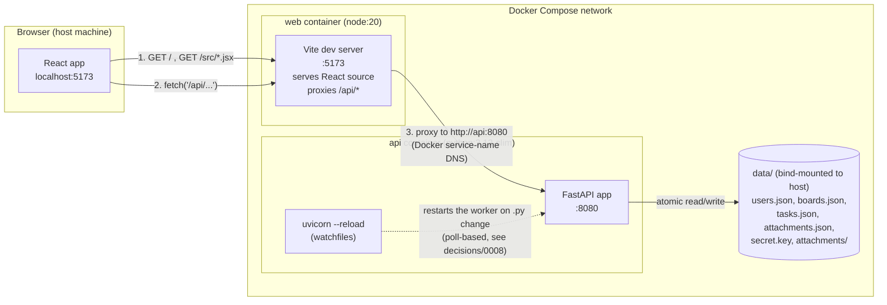

# System Architecture

Everything runs through Docker Compose (see [`../decisions/0001-docker-only-dev-workflow.md`](../decisions/0001-docker-only-dev-workflow.md)): a `web` container running the Vite dev server and an `api` container running the Python (FastAPI) backend under `uvicorn --reload`, joined by Docker's default bridge network. The browser only ever talks to the `web` container; the `api` container is never reached directly from outside Docker in normal use.

Key points:

- **Two dev servers, one origin from the browser's perspective.** The browser only ever calls `localhost:5173`; Vite's `server.proxy` config forwards anything under `/api` to the `api` container. This is why frontend code (`web/src/api.js`) only ever calls relative `/api/...` paths — it never needs to know the API's real address.
- **`http://api:8080`, not `http://localhost:8080`.** Vite's dev server process runs *inside* the `web` container, so `localhost` from its perspective is the `web` container itself. Docker Compose gives each service a DNS name equal to its service key, so the proxy target is `http://api:8080`, wired in as the `VITE_API_PROXY_TARGET` env var in `docker-compose.yml` (see [`../decisions/0001-docker-only-dev-workflow.md`](../decisions/0001-docker-only-dev-workflow.md)).
- **`data/` is a host bind mount**, not a container-only volume, so the JSON collections, the HMAC signing secret, and uploaded attachment blobs all survive `docker compose down`/`up` and are directly inspectable on the host.
- This diagram is **dev mode**. For production mode (nginx serving a prebuilt bundle, no Node at runtime), and for how Vite's on-demand compilation and HMR WebSocket work, see [`dev-vs-prod-serving.md`](dev-vs-prod-serving.md).
- For what happens inside a login request specifically, see [`auth-sequence.md`](auth-sequence.md). For the shape of the data in `data/`, see [`data-model.md`](data-model.md).
